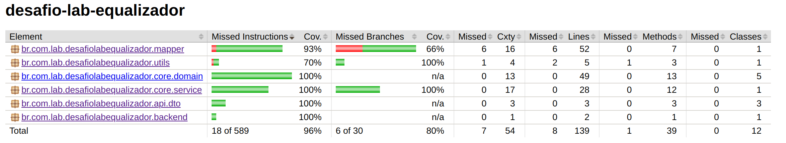

# Getting Started

## LuizaLabs - Desafio técnico - Vertical Logística

### Documentacao de referencia

O objetivo desse projeto
e fornecer uma arquitetura confiavel para realizar a conversão de arquivos
no formato legado para o formato do novo sistema.

Foi utilizado conceitos de arquitetura hexagonal, onde o core entende apenas entidades de dominio e fica isolado de
contextos externos.
As chamadas de entrada para acesso são feitas via adapters, no projeto o adapter é feito via Rest, via HTTP.
O sistema não possui necessidade de acessos externos para utilizaćão de ports. Caso necessário, basta realizar por meio
das portas.

Foi utizado DDD onde os dominios (core) são capazes de se montar e gerenciar.
Foi utlizado TDD na service para gerar o teste antes do código.

Os testes foram escritos em groovy para uma sintaxe empressiva e fuilda. E utilizado spock para mock.

O projeto prossui validaćão de cobertura de testes para o codigo e esta programado para 96% de cobertura, caso
incrementado codigo sem cobertura de testes, o build irá quebrar automaticamente.

Não foi utilizando nenhum tipo de persistencia por se tratar apenas de um conversor.

## Repositorio

* [Github](https://github.com/igorcalangotech/desafio-lab-equalizador)

## Test Coverage



[Link to Site](doc/index.html)

### Tecnologias

* Java 17
* Springboot 3
* Mapstruct

## Run tests

````shell
mvn clean install
````

## Running

* Apache maven
* JDK 17
* Unix/Linux OS

````shell
kill -9 $(lsof -t -i:8080) && mvn clean install && mvn spring-boot:run
````

### Exemplo de Requisição `curl`

Para testar a API, execute o seguinte comando no terminal:

🔥 Lembre-se de colocar o caminho correto do arquivo para converter

🔥 Os filtros são informados via request param: `orderId=684&beginDate=2021-05-01&endDate=2021-05-30`

🔥 Caso não seja necessario os filtros, basta remover.

```sh
curl --location 'http://localhost:8080/api/v1/pedido/legado/converter?orderId=684&beginDate=2021-05-01&endDate=2021-05-30' \
--form 'file=@"/diretorioArquivo/data_1.txt"'
```

### Exemplo de Resposta

```
[
    {
        "user_id": 64,
        "name": "Quintin Turcotte",
        "orders": [
            {
                "order_id": 684,
                "total": 2661.33,
                "date": "2021-05-01",
                "products": [
                    {
                        "product_id": 1,
                        "value": 354.35
                    },
                    {
                        "product_id": 2,
                        "value": 1270.52
                    },
                    {
                        "product_id": 3,
                        "value": 1036.46
                    }
                ]
            }
        ]
    }
]
```
